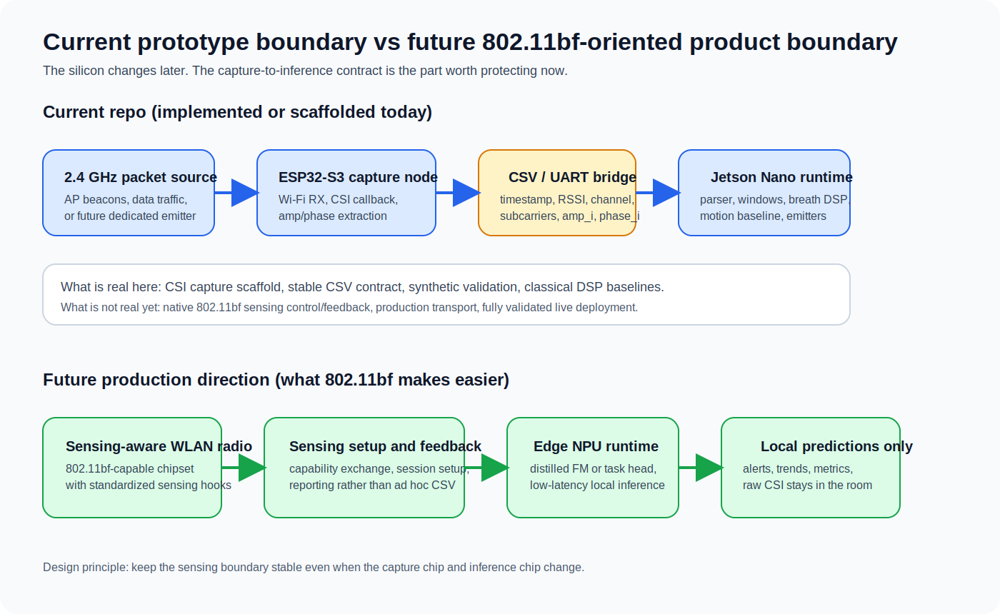
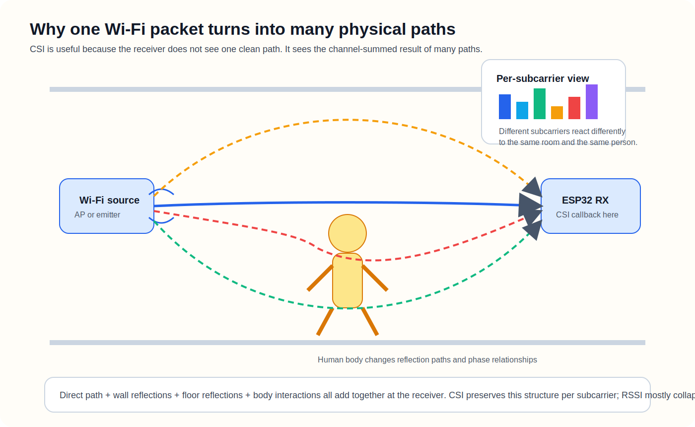
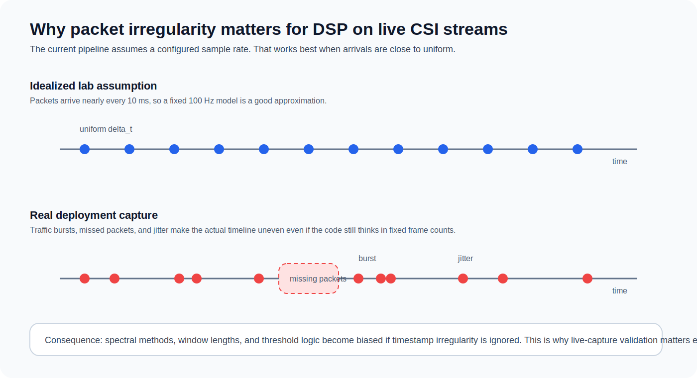
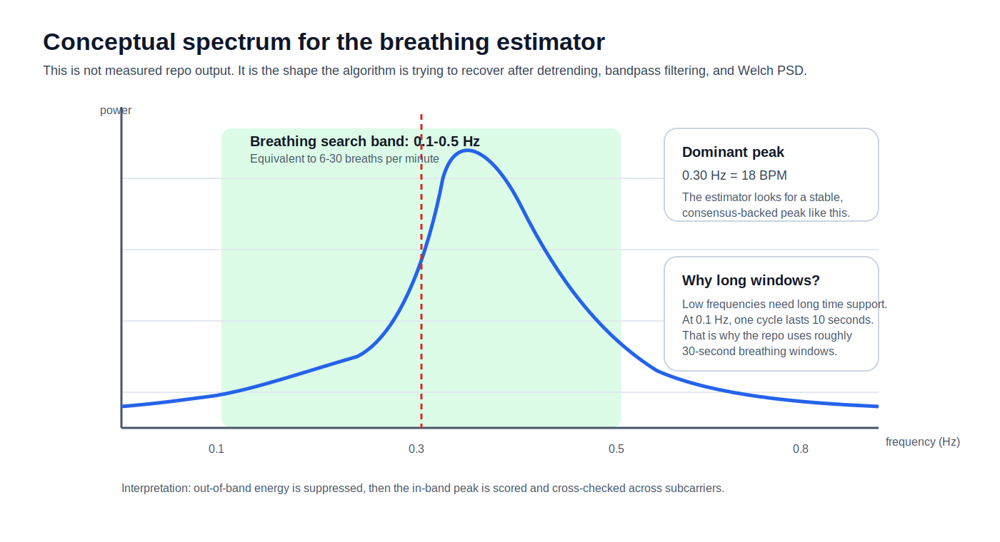
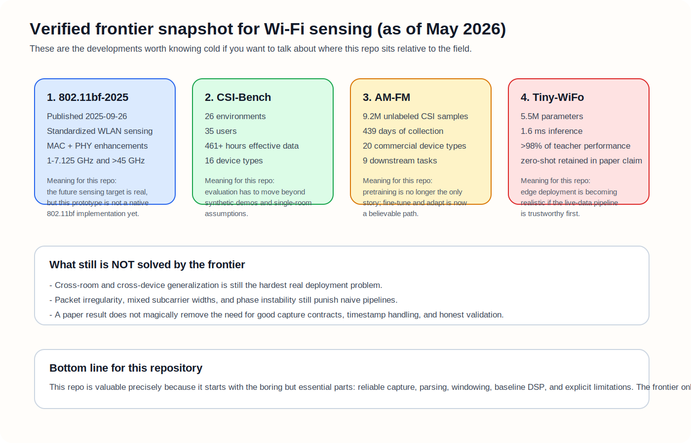

# From Radio Waves to Room Intelligence

An educational field guide to the `wifi-sensing-edge` repository: what it is, why it exists, how it works from low level to high level, and what still needs to happen before it becomes a production-grade sensing system.

## Who this book is for

This guide is for a reader who already understands software engineering, but does not yet think comfortably in RF, Wi-Fi signal behavior, CSI, or embedded-to-edge sensing pipelines.

The goal is not just to explain the code. The goal is to explain the engineering logic behind the code so that you can answer questions like these with confidence:

- Why use Wi-Fi sensing instead of cameras or wearables?
- What exactly does the ESP32 measure?
- Why is the Jetson needed if the ESP32 already has a CPU?
- What is CSI, and why is it more useful than RSSI?
- Why does breathing require long windows while motion does not?
- What is implemented today, and what is still just architecture intent?

## How to read this document

Read it in order the first time.

The chapters move in the only sequence that actually builds understanding:

1. Problem and constraints
2. RF and Wi-Fi intuition
3. CSI as the measurable signal
4. Hardware roles
5. Repository architecture
6. Firmware path
7. Jetson ingest path
8. Sensing algorithms
9. Current status and future work

If you skip the fundamentals and jump straight into the code, you will understand the syntax but not the system. That is how people end up cargo-culting signal-processing code they cannot defend.

## Executive orientation

The system in one sentence:

> An ESP32-S3 captures Wi-Fi Channel State Information from received packets, streams a CSV representation over serial, and a Jetson Nano turns those measurements into room-level sensing estimates such as breathing and motion.

The three most important truths about this repository are:

1. It is a serious prototype, not a finished product.
2. The current repo proves the sensing pipeline shape and classical baselines, mostly on synthetic data.
3. The architecture is intentionally split so the capture boundary can survive future hardware changes.



_Figure 1. The current repo already has the boundary that matters: capture on one side, inference on the other. Future 802.11bf-oriented hardware should change the silicon, not the system idea._

## Frontier update (verified snapshot, May 2026)

If you want to sound like you actually know the field and not just this repo, these are the developments you need in your head.

| Area              | Verified development                                                                                                                    | Why it matters here                                                                                          | What NOT to overclaim                                                                    |
| ----------------- | --------------------------------------------------------------------------------------------------------------------------------------- | ------------------------------------------------------------------------------------------------------------ | ---------------------------------------------------------------------------------------- |
| Standardization   | `IEEE 802.11bf-2025` is published and defines WLAN sensing enhancements at the MAC and PHY layers.                                      | It validates that Wi-Fi sensing is becoming a first-class standards topic, not just a lab trick.             | Do not say this repo is already a native 802.11bf implementation. It is not.             |
| Benchmarking      | `CSI-Bench` publishes a large in-the-wild benchmark with `26` environments, `35` users, `461+` effective hours, and `16` device types.  | It gives a much more realistic picture of cross-room, cross-device variability than clean lab-only datasets. | Do not claim synthetic validation is an adequate substitute for this level of diversity. |
| Foundation models | `AM-FM` argues for a Wi-Fi foundation model trained on `9.2M` unlabeled CSI samples across `439` days and `20` commercial device types. | It strengthens the repo's strategy of fine-tuning rather than training from scratch later.                   | Do not claim that foundation models magically solve deployment robustness.               |
| Edge deployment   | `Tiny-WiFo` reports a distilled model with `5.5M` parameters and `1.6 ms` inference time while retaining most teacher performance.      | It supports the idea that edge deployment of Wi-Fi foundation models is becoming practical.                  | Do not present a paper result as proof that this repo is already deployment-ready.       |

> Reality check: the frontier is moving fast, but the hard deployment problems are still the ugly ones - live capture quality, phase stability, packet irregularity, domain gap across rooms, and trustworthy evaluation.

One useful way to think about evidence quality is this ladder:

| Evidence level                       | What it proves                                           | What it cannot prove                  |
| ------------------------------------ | -------------------------------------------------------- | ------------------------------------- |
| Synthetic simulator                  | Contract integrity and baseline algorithm behavior       | Real RF behavior                      |
| Public benchmark such as `CSI-Bench` | Generalization pressure across environments and hardware | Your exact deployment stack           |
| Your own live captures               | Whether this repo's assumptions survive reality          | Industry-wide robustness claims       |
| Production deployment                | Whether the system actually works at operational scale   | Nothing else matters if you fail here |

## 1. Why this project exists

The repository is building ambient perception infrastructure for senior care and aging-in-place monitoring.

The target outcomes are:

- passive presence detection
- breath-rate estimation
- motion state estimation
- later, fall detection and broader wellness monitoring

The design constraints are as important as the sensing goal itself:

| Constraint         | Why it matters                                                                                                                        |
| ------------------ | ------------------------------------------------------------------------------------------------------------------------------------- |
| No cameras         | Cameras create privacy, acceptance, and regulatory problems in homes and care environments.                                           |
| No wearables       | Wearables depend on user compliance; the people who most need monitoring are often the least likely to keep devices charged and worn. |
| Edge inference     | Raw sensing data should stay in the room for privacy, trust, and future compliance posture.                                           |
| Commodity hardware | The system must be cheap enough to deploy at scale, not just impressive in a lab.                                                     |
| Low latency        | A useful edge sensor cannot take seconds to decide whether something important happened.                                              |

This is why the project uses off-the-shelf Wi-Fi hardware instead of custom radar, and why the repo keeps repeating the same message: capture locally, infer locally, emit only the result.

## 2. RF and Wi-Fi for software engineers

Before talking about code, we need the correct mental model.

### 2.1 Wi-Fi is not just packets

Most programmers think about Wi-Fi at the packet or socket level:

- a device sends bytes
- another device receives bytes
- the network stack handles the rest

That view is useful for application development, but useless for sensing.

At the physical level, Wi-Fi is a radio wave traveling through space. The room affects that wave. Walls, furniture, metal, doors, and especially human bodies change how the signal propagates. That means the wireless channel is not just a transport medium. It is also a sensor.

### 2.2 The channel is a physical object

When a Wi-Fi packet travels from transmitter to receiver, it does not follow one perfect straight path.

Instead, the receiver sees multiple copies of the same signal:

- one direct path
- several reflected paths from walls and furniture
- attenuated or phase-shifted paths through or around the human body

This is called multipath propagation.

The receiver gets the sum of all of those paths. If the room changes, the sum changes. If a person walks, the channel changes a lot. If a person breathes, the channel changes only a little, but it still changes.

That is the entire sensing idea.



_Figure 2. One packet does not arrive as one path. CSI becomes valuable because the receiver sees the combined result of several physical paths, and each subcarrier responds a little differently._

### 2.3 Why breathing can affect Wi-Fi

Breathing causes small periodic motion in the chest and torso. That motion slightly changes reflection paths and phase relationships in the channel.

The effect is subtle. It is not like someone walking across the room. That is why the breathing estimator needs:

- many packets over time
- filtering
- spectral analysis
- agreement across multiple subcarriers

You do not detect breathing from one packet. You infer it from a time series.

### 2.4 OFDM and subcarriers

Modern Wi-Fi does not send a packet as one single tone. It uses OFDM: Orthogonal Frequency Division Multiplexing.

That means one Wi-Fi channel is divided into many narrow frequency bins called subcarriers.

Why that matters for sensing:

- each subcarrier experiences the room slightly differently
- one subcarrier may be noisy while another is stable
- the pattern across subcarriers tells you much more than a single aggregate number

This is why the project works with vectors of amplitudes and phases instead of only one RSSI value.

## 3. What CSI actually is

CSI means Channel State Information.

In practical terms, CSI is a per-subcarrier estimate of how the wireless channel affected a received packet.

Each subcarrier measurement is fundamentally complex-valued, meaning it contains:

- magnitude or amplitude
- phase

You can think of each subcarrier as having a value like this:

`H[k] = amplitude[k] * exp(j * phase[k])`

The repo does not keep the raw complex number. The ESP32 firmware converts the I/Q representation into amplitude and phase before sending it to the Jetson.

### 3.1 CSI versus RSSI

RSSI is a single coarse power number for a packet.

CSI is a structured channel snapshot across subcarriers.

| Signal view | What it tells you                    | Limitation                                                                   |
| ----------- | ------------------------------------ | ---------------------------------------------------------------------------- |
| RSSI        | Approximate total received power     | Collapses the entire channel into one number                                 |
| CSI         | Frequency-selective channel response | More informative, but more complex to process                                |
| Raw I/Q     | Very low-level complex samples       | More flexible, but heavier and lower-level than this project currently needs |

For sensing, RSSI alone is usually too crude. CSI gives the structure needed to see subtle channel variation.

### 3.2 Where CSI comes from in Wi-Fi reception

The receiver estimates the channel from known training fields in the Wi-Fi frame structure. In this repository, the firmware enables CSI collection from training fields such as:

- LLTF
- HT-LTF
- STBC HT-LTF2

These are exactly the parts of the packet that let the receiver estimate how the channel transformed the signal.

That matters because CSI is not packet payload. It is not the contents of the frame. It is the receiver's estimate of the channel that the frame traveled through.

### 3.3 Why CSI is useful here

If the room is static, CSI tends to fluctuate within a limited pattern.

If someone enters the room, moves, or breathes, the multipath structure changes. Those changes show up in:

- amplitude variation over time
- phase variation over time
- different behavior across different subcarriers

The current repo mostly exploits amplitude over time. That is a deliberate simplification, not a statement that phase is useless.

## 4. The sensing setup in this project

The physical sensing scene is simple in concept even if the signal behavior is not.

### 4.1 Core actors

| Component                             | Role                                                          |
| ------------------------------------- | ------------------------------------------------------------- |
| Access Point (or other packet source) | Produces Wi-Fi traffic so the receiver has packets to measure |
| ESP32-S3 receiver                     | Captures CSI for received packets                             |
| Jetson Nano                           | Parses, buffers, processes, and emits sensing results         |
| Room and person                       | The environment that modulates the channel                    |
| Optional second ESP32 emitter         | Future deterministic packet source for controlled capture     |

### 4.2 Why an AP is needed

The ESP32 does not invent CSI out of thin air. It only gets CSI when packets are being received.

That means you need ongoing packet traffic. In early bring-up, a normal 2.4 GHz access point is enough because it creates regular beacons and other traffic. Later, a dedicated emitter can make experiments more controlled.

### 4.3 Why channel 6 appears in the docs

The architecture docs describe a representative setup around channel 6 at 2.437 GHz. That is a practical 2.4 GHz test choice, not a magical sensing frequency.

What matters more than the exact channel number is:

- stable packet traffic
- known RF environment
- reproducible placement of transmitter, receiver, and target

## 5. Hardware stack and why it is split

The hardware bill of materials is intentionally modest.

### 5.1 Prototype hardware

| Item                          | Role                                                     |
| ----------------------------- | -------------------------------------------------------- |
| ESP32-S3-DevKitC-1            | Wi-Fi RF frontend and CSI capture node                   |
| External 2.4 GHz antenna path | Better RF performance than relying only on a PCB antenna |
| Jetson Nano 4GB               | Edge runtime for parsing and inference                   |
| USB serial link               | Current transport from ESP32 to Jetson                   |

### 5.2 Why the ESP32 does capture and the Jetson does inference

This split is one of the most important architecture decisions in the whole repo.

The ESP32 is responsible for:

- joining Wi-Fi
- receiving packets
- extracting CSI through the ESP-IDF APIs
- serializing measurements to a stable wire format

The Jetson is responsible for:

- ingesting the stream
- validating and parsing frames
- building time windows
- running signal-processing baselines
- eventually running learned models
- exposing outputs to operators and downstream systems

Why not do everything on the ESP32?

Because that would be the wrong optimization at the wrong layer.

The ESP32 is cheap and good at embedded I/O and radio-adjacent work. The Jetson has more RAM, a stronger CPU/GPU environment, and a path to accelerated inference. The point of the repo is not to win an embedded golf game by stuffing everything onto one chip. The point is to build a credible sensing boundary that can evolve.

### 5.3 Why this boundary matters for the future

The repo expects the exact chips to change later.

Today:

- ESP32-S3 as CSI-capable prototype receiver
- Jetson Nano as edge compute node

Future intent:

- sensing-aware 802.11bf-capable radio silicon on the capture side
- integrated embedded NPU SoC on the inference side

The architecture survives if the contract survives.

That is why the repository invests early in the capture-to-ingest boundary.

## 6. End-to-end architecture

The system path can be described in one chain:

1. A Wi-Fi packet is transmitted in the room.
2. The ESP32 receives it and estimates the channel.
3. The ESP32 callback converts raw CSI buffer values into amplitude and phase pairs.
4. The ESP32 prints one CSV line over UART.
5. The Jetson reads the line.
6. The parser turns the line into a structured `CSIFrame`.
7. The pipeline appends the frame to a sliding window.
8. Estimators run on recent windows.
9. The system emits a human-readable or machine-readable result.

That is the whole machine.

The current architecture targets an end-to-end latency budget below 100 ms, but those numbers are still design targets, not measured benchmark evidence.

## 7. ESP32 firmware path: from packet reception to CSV

The firmware lives in `firmware/csi-recv/`.

This is the low-level half of the system.

### 7.1 Boot path

`app_main()` does three important things:

1. initializes NVS
2. initializes Wi-Fi station mode
3. enables CSI collection

From there, the application mostly relies on event-driven callbacks.

### 7.2 Wi-Fi initialization

`wifi_init_sta()` sets up the station interface and starts Wi-Fi.

Important details:

- it uses `WIFI_MODE_STA`
- SSID and password come from configuration
- power save is disabled with `esp_wifi_set_ps(WIFI_PS_NONE)`
- the disconnect handler immediately reconnects

Disabling power save is not cosmetic. It reduces one class of timing and packet-delivery weirdness that would make sensing harder.

### 7.3 CSI initialization

`csi_init()` enables promiscuous mode, applies a CSI config, registers the CSI callback, and then enables CSI collection.

The enabled training-field flags include:

- `lltf_en = true`
- `htltf_en = true`
- `stbc_htltf2_en = true`
- `ltf_merge_en = true`
- `channel_filter_en = true`
- `manu_scale = false`

The important idea is not memorizing each flag. The important idea is knowing that the firmware is telling the radio stack which training-derived channel information to expose.

### 7.4 What the callback receives

The CSI callback receives metadata and a raw CSI buffer.

The raw buffer is treated as interleaved signed 8-bit values representing imaginary and real components.

For subcarrier `i`:

- `imag = buf[2*i]`
- `real = buf[2*i + 1]`

The firmware then computes:

- `amplitude = sqrt(real^2 + imag^2)`
- `phase = atan2(imag, real)`

This is a basic conversion from I/Q form into polar form.

The heart of that logic is visible directly in the callback:

```c
const int n_subcarriers = info->len / 2;
const int64_t ts_us = esp_timer_get_time();
const int8_t *buf = info->buf;

printf("%" PRId64 ",%d,%d,%d",
       ts_us,
       info->rx_ctrl.rssi,
       info->rx_ctrl.channel,
       n_subcarriers);

for (int i = 0; i < n_subcarriers; ++i) {
    const int8_t imag = buf[2 * i];
    const int8_t real = buf[2 * i + 1];
    const float amp = sqrtf((float)((int)real * real + (int)imag * imag));
    const float phase = atan2f((float)imag, (float)real);
    printf(",%.3f,%.4f", amp, phase);
}
```

That snippet teaches four important lessons:

1. the raw CSI payload is not yet in a convenient scientific form
2. each packet becomes one row in a time series
3. amplitude and phase are derived per subcarrier
4. the transport contract is created at the firmware boundary, not later

### 7.5 What gets exported

Each packet becomes one CSV line with this shape:

```text
timestamp_us,rssi,channel,subcarrier_count,amp_0,phase_0,amp_1,phase_1,...
```

Field meaning:

| Field              | Meaning                                                     |
| ------------------ | ----------------------------------------------------------- |
| `timestamp_us`     | Microseconds since boot according to `esp_timer_get_time()` |
| `rssi`             | Packet RSSI metadata                                        |
| `channel`          | Wi-Fi channel observed for that frame                       |
| `subcarrier_count` | Number of CSI subcarriers serialized                        |
| `amp_i`            | Amplitude for subcarrier `i`                                |
| `phase_i`          | Phase for subcarrier `i`                                    |

Two details matter here:

1. The timestamp is not wall-clock time.
2. The current downstream pipeline mainly uses amplitudes, even though phase is already available.

### 7.6 What is good and what is still scaffold-level

Good:

- the firmware defines a clear transport contract
- the output is easy to inspect manually
- the downstream code can be developed before hardware validation is complete

Scaffold-level compromise:

- the callback uses `printf` in the Wi-Fi receive path

That is acceptable for a prototype because it keeps the system debuggable. It is not ideal for a production path because heavy printing inside the receive path can add latency and backpressure. The correct future direction is a ring buffer plus a dedicated emitter task.

### 7.7 Important ambiguity to understand

The repository has a real serial-speed inconsistency.

- some docs and Python CLIs still say `115200`
- firmware documentation and config defaults reference `921600`

That is not a paperwork issue. It affects real capture throughput and reliability. Any serious hardware bring-up should resolve this first.

## 8. Jetson ingest path: from serial bytes to structured frames

The Jetson-side ingest code lives mainly in `jetson/ingest/`.

This layer is where the project stops being a serial dump and becomes an actual software system.

### 8.1 `CSIFrame` as the contract

`jetson/ingest/types.py` defines `CSIFrame`.

It stores:

- `timestamp_us`
- `rssi`
- `channel`
- `amps`
- `phases`

The dataclass enforces that amplitudes and phases have matching shapes and that amplitudes are one-dimensional arrays.

That matters because sloppy input contracts destroy trust in every downstream algorithm.

### 8.2 Parsing a line

`parse_line()` in `jetson/ingest/parser.py` does the following:

1. trims whitespace
2. rejects empty lines
3. splits by commas
4. checks that at least the first four fields exist
5. parses header integers
6. verifies the exact expected field count: `4 + 2 * subcarrier_count`
7. parses alternating amplitude and phase fields into `float32` arrays
8. returns a `CSIFrame`

This is not glamorous work. It is foundational work.

People love talking about AI. Serious systems start by refusing malformed input.

The exact wire-contract check is refreshingly blunt:

```python
parts = stripped.split(",")
if len(parts) < 4:
    raise ParseError(f"expected at least 4 header fields, got {len(parts)}")

timestamp_us = int(parts[0])
rssi = int(parts[1])
channel = int(parts[2])
subcarrier_count = int(parts[3])

expected_fields = 4 + 2 * subcarrier_count
if len(parts) != expected_fields:
    raise ParseError(
        f"declared {subcarrier_count} subcarriers => expected "
        f"{expected_fields} fields, got {len(parts)}"
    )
```

This is exactly the kind of code you want in a serious sensing system. Before asking whether a model is smart, ask whether the input is even structurally true.

### 8.3 Strict versus non-strict parsing

`parse_stream()` supports both strict and non-strict behavior.

- strict mode raises on malformed lines
- non-strict mode skips bad lines

This is useful because development and operations do not always want the same failure mode.

### 8.4 Live serial ingest

`jetson/ingest/serial.py` reads lines from the serial port, decodes them as UTF-8 with replacement, and feeds them into the parser.

This is intentionally simple. The project is optimizing for bring-up clarity before optimizing for binary framing efficiency.

## 9. Sliding windows and orchestration

Single packets are not enough for the sensing tasks in this repository.

The system needs time windows.

### 9.1 Why windows exist

Breathing is a slow periodic effect. Motion is a faster energy-change effect. Both require temporal context.

The pipeline therefore stores recent frames in a `SlidingWindow` implemented with a bounded deque.

### 9.2 What the window stores

The current implementation primarily uses amplitude matrices shaped like:

`(n_packets, n_subcarriers)`

The helper methods return the last `n` frames stacked into a matrix so estimators can work on a clean numerical input.

### 9.3 Processing cadence

The orchestrator in `jetson/pipeline/orchestrator.py` converts time settings into frame counts using the configured sample rate.

With the demo defaults:

- sample rate: `100 Hz`
- total buffer: `60 s`
- breath window: `30 s`
- motion window: `2 s`
- process cadence: once every `100` frames, which is effectively once per second at `100 Hz`

This means:

- the buffer can hold enough history for multiple estimators
- motion reacts much faster than breath
- the system does not need to recompute everything on every packet

### 9.4 Important limitation

The pipeline assumes a fixed sample rate supplied by configuration.

It does not currently:

- derive sampling rate from timestamps
- resample irregular arrivals
- compensate for dropped packets

That is fine for a controlled prototype. It becomes a real engineering issue once live capture behavior gets messy.

The cadence logic today is intentionally simple:

```python
max_frames = int(window_seconds * sample_rate_hz)
self.window = SlidingWindow(max_frames=max_frames)
self._breath_window_n = int(breath_window_seconds * sample_rate_hz)
self._motion_window_n = int(motion_window_seconds * sample_rate_hz)
self._process_every = process_every_frames
```

That simplicity is good for bring-up and pedagogy. It is also the exact place where real deployment pressure will hit first.



_Figure 3. A configured sample rate is only a good approximation when the packet stream is close to uniform. Real captures do not always behave that politely._

What a more mature pipeline eventually needs:

- timestamp-aware effective sample-rate estimation
- gap detection and packet-loss accounting
- optional resampling before frequency-domain estimation
- confidence penalties when live timing deviates too far from assumptions

### 9.5 Output surfaces

The pipeline can emit to:

- human-readable stdout
- JSONL records
- a live terminal dashboard via Rich

This is useful because the same sensing core can support debugging, demos, and machine integration.

## 10. Breath-rate estimation: the real algorithm, step by step

The breath estimator lives in `jetson/preprocess/breath_rate.py`.

This is one of the most instructive parts of the project because it shows how a weak periodic physical effect gets extracted from noisy measurements.

### 10.1 Input and goal

Input:

- a 2-D amplitude matrix shaped `(n_packets, n_subcarriers)`

Goal:

- estimate breathing frequency and convert it to breaths per minute

### 10.2 Why this is hard

Breathing is low frequency.

The default search band is:

- `0.1 Hz` to `0.5 Hz`
- equivalent to `6` to `30` breaths per minute

That means the estimator is trying to recover a slow oscillation from noisy channel measurements. You do not solve that by staring at raw samples and hoping for enlightenment.

### 10.3 Algorithm overview

The current implementation is more than a raw FFT. The real pipeline is:

1. validate input and band
2. require enough samples for the low-frequency band
3. linearly detrend each subcarrier
4. bandpass filter the signal
5. discard near-constant subcarriers
6. compute Welch power spectra per subcarrier
7. keep only the breathing band
8. normalize each subcarrier by its own median spectral power
9. score peak sharpness per subcarrier
10. find consensus across subcarriers
11. combine the best subcarriers
12. refine the final peak and convert to BPM

That is the real estimator. Calling it merely an FFT estimator is stale documentation.



_Figure 4. Conceptual picture of what the estimator is hunting for: a stable in-band peak around a plausible breathing frequency, not just any large fluctuation._

### 10.4 Step 1: require enough data

The code enforces a minimum sample rule based on the lowest frequency in the band:

`min_samples = ceil(2 * fs / low_hz)`

With:

- `fs = 100 Hz`
- `low_hz = 0.1 Hz`

you need at least 20 seconds of data just to support the band meaningfully.

That is why the default breath window is 30 seconds. Short windows would make the estimate unstable or physically meaningless.

### 10.5 Step 2: detrend

Each subcarrier is linearly detrended.

Why?

Because slow drift and DC offset can dominate the low-frequency region you care about. If you skip detrending, you risk mistaking baseline drift for physiology.

The code makes that logic explicit:

```python
min_samples_for_band = int(np.ceil(2.0 * sample_rate_hz / low_hz))
if n_packets < min_samples_for_band:
    raise ValueError(
        f"need >= {min_samples_for_band} samples to detect {low_hz} Hz "
        f"reliably, got {n_packets}"
    )

detrended = _scipy_signal.detrend(amps.astype(np.float64), axis=0, type="linear")

sos = _scipy_signal.butter(
    2,
    [low_hz, high_hz],
    btype="bandpass",
    fs=sample_rate_hz,
    output="sos",
)
filtered = _scipy_signal.sosfiltfilt(sos, detrended, axis=0)
```

And later, when it wants a stable frequency estimate instead of a noisy guess, it does this:

```python
freqs, spectra = _scipy_signal.welch(
    filtered,
    fs=sample_rate_hz,
    window="hann",
    nperseg=nperseg,
    noverlap=noverlap,
    detrend=False,
    scaling="spectrum",
    axis=0,
)
```

The important conceptual jump is this: the algorithm is not looking for "some movement." It is looking for repeatable low-frequency structure that survives filtering, spectral estimation, and subcarrier agreement.

### 10.6 Step 3: bandpass filter

The estimator applies a second-order Butterworth bandpass over `0.1` to `0.5 Hz` using zero-phase filtering.

Why?

- it removes energy outside the plausible breathing region
- it makes the later spectrum more interpretable
- zero-phase filtering avoids shifting the oscillation in time

### 10.7 Step 4: ignore useless subcarriers

After filtering, subcarriers with near-zero standard deviation are discarded.

That matters because some subcarriers simply do not carry useful breathing variation for a given scene.

### 10.8 Step 5: Welch PSD per subcarrier

The estimator computes Welch power spectral density for each remaining subcarrier.

Why Welch instead of a single naive FFT?

- better robustness in noisy signals
- reduced variance in the power estimate
- more stable spectral peaks for weak periodic structure

This is a real engineering choice, not academic decoration.

### 10.9 Step 6: normalize by median spectral power

Each subcarrier's in-band spectrum is normalized by its own median in-band power.

This turns the algorithm into a relative peak detector rather than an absolute power contest.

That is important because one subcarrier may be strong overall but not meaningfully respiratory, while another has a cleaner relative breathing peak.

### 10.10 Step 7: consensus across subcarriers

The estimator does not blindly trust the single strongest subcarrier.

Instead, it looks for a dominant peak bin that multiple subcarriers agree on. Agreement within `+-1` frequency bin counts as consensus.

This is one of the smartest parts of the design.

Why?

Because real breathing should perturb a cluster of subcarriers in a related way. A lone dramatic peak may just be noise or a local artifact.

### 10.11 Step 8: combine top subcarriers

The estimator selects up to `10` useful subcarriers and averages their normalized in-band spectra.

This makes the final estimate more stable than trusting one subcarrier alone.

### 10.12 Step 9: refine and score the estimate

The final dominant peak becomes the breathing frequency.

The estimator then:

- converts frequency to BPM using `bpm = hz * 60`
- applies parabolic interpolation around the peak for sub-bin refinement
- computes a confidence score based on peak prominence and consensus concentration

The confidence is not clinical certainty. It is an internal quality signal that says how sharply and consistently the breathing peak stands out.

### 10.13 What this estimator is really assuming

The code assumes that:

- packet arrival rate is effectively regular enough for the configured sample rate to be meaningful
- breathing energy is visible in amplitudes
- useful subcarriers will show clustered evidence
- long windows are acceptable for respiration estimation

Those are reasonable prototype assumptions. They are still assumptions.

## 11. Motion and presence estimation: a simpler baseline

The motion estimator lives in `jetson/preprocess/motion.py`.

It is intentionally much simpler than the breath estimator.

### 11.1 Core idea

Movement causes temporal variation in the channel. So the estimator uses the variance of amplitudes over time.

Algorithm:

1. compute variance per subcarrier across the window
2. take the top `k` most variable subcarriers
3. average those variances into one motion score
4. threshold the score into a discrete state

### 11.2 Default thresholds

| Motion score          | State      |
| --------------------- | ---------- |
| `< 1.0`               | `idle`     |
| `>= 1.0` and `< 15.0` | `presence` |
| `>= 15.0`             | `movement` |

### 11.3 Why motion uses a short window

Motion is not a slow periodic micro-signal like breathing. Large body movement perturbs the channel quickly.

That is why the default motion window is only 2 seconds while the breath window is 30 seconds.

Different physical phenomena demand different temporal strategies.

### 11.4 Why this baseline is useful even though it is simple

Because it gives the project an honest reference point.

Before adding learned models, you want to know:

- what crude variance-based sensing can already do
- where it fails
- whether a future model really improves the system

That is how adults compare models. Not with vibes.

### 11.5 What it does not do yet

The motion estimator currently does not:

- use phase
- normalize by RSSI
- model packet irregularity
- perform frequency analysis
- adapt thresholds per room or per installation

The code itself is honest that the thresholds are calibrated against the simulator, not real validated CSI captures.

## 12. The simulator is not fake work; it is controlled work

The simulator in `scripts/csi_simulator.py` is one of the most important development tools in the repo.

### 12.1 Why it exists

It lets the entire pipeline run before the hardware path is fully validated.

The simulator emits the same wire format that the firmware uses:

```text
timestamp_us,rssi,channel,subcarrier_count,amp_0,phase_0,...
```

That means the parser, windowing logic, estimators, and emitters can be exercised end to end.

### 12.2 Simulator modes

The simulator supports four qualitative states:

- `idle`
- `presence`
- `breathing`
- `walking`

It does this by varying noise levels and, for the breathing mode, injecting a sinusoidal modulation around `0.3 Hz`, which corresponds to `18 BPM`.

### 12.3 What the simulator proves

It proves that:

- the CSV contract is coherent
- the parser can ingest frames correctly
- the pipeline can run to completion
- the estimators behave sensibly on controlled synthetic conditions
- automated tests can be deterministic

### 12.4 What the simulator does not prove

It does not prove:

- real RF propagation behavior
- UART robustness under live throughput
- mixed-width CSI handling under real hardware noise
- deployment-grade sensing accuracy
- generalization across rooms and installations

Synthetic success is useful. It is not the same thing as live sensing validation.

## 13. What the tests currently validate

The repository includes automated coverage across ingest, serial behavior, estimators, pipeline, and scripts.

Important examples:

- breath-rate tests check that the synthetic breathing case is recovered within a reasonable tolerance
- motion tests check score ordering from idle to walking
- parser tests validate malformed-line handling and field-count correctness
- pipeline tests validate orchestration behavior

One important housekeeping note: some top-level docs still say there are 27 tests, but the current repository contains 39 test functions. That means the implementation outpaced the prose.

## 14. What is real today versus what is planned

This chapter matters because technical credibility depends on distinguishing verified reality from roadmap language.

### 14.1 Implemented today

- ESP32 CSI receiver scaffold in `firmware/csi-recv/`
- CSV wire contract from firmware to Jetson
- Jetson parser and typed frame model
- sliding-window orchestration
- synthetic CSI simulator
- breath-rate baseline on synthetic data
- motion baseline on synthetic data
- demo pipeline with terminal output modes
- capture and filtering utilities for future real serial datasets

### 14.2 Not implemented yet, or not validated yet

- no learned model serving path in active use
- no TensorRT runtime in the current implemented sensing path
- no real benchmark evidence for the latency budget yet
- no confirmed live hardware validation archived in the repo
- no completed notebooks for real CSI analysis
- no validated fall detection
- no multi-room sensing mesh

### 14.3 Important present-tense limitations

You should be able to say these out loud without flinching:

- the current baseline is amplitude-first; phase is captured but not exploited
- the pipeline assumes a configured sample rate instead of deriving one from timestamps
- motion thresholds are simulator-calibrated
- serial throughput settings need cleanup
- firmware `printf` in the receive path is acceptable for bring-up, not ideal for production

If you hide these facts, you are not being technical. You are being fragile.

### 14.4 Where the frontier now sits relative to this repo

This repository is not behind the field because it lacks a deployed foundation model. That would be the wrong reading.

The honest reading is this:

- the field is standardizing the sensing side through `802.11bf-2025`
- public evaluation is getting more realistic through `CSI-Bench`
- representation learning is moving toward Wi-Fi foundation models such as `AM-FM`
- edge deployment is becoming more plausible through distilled models such as `Tiny-WiFo`

But NONE of that rescues a sloppy capture path.



_Figure 5. The field is maturing fast, but the boring engineering still decides whether a prototype can cross the line into a real system._

So the repo's current sequence is actually intellectually correct:

1. get the capture boundary right
2. get the parser and windows right
3. establish classical baselines
4. validate on live data
5. only then decide how much model complexity the system deserves

## 15. Why edge inference is an architectural principle

The project keeps insisting that raw sensing data should stay on-device. That is not just a latency argument.

It is also about:

- privacy posture
- trust with users and facilities
- reducing the surface area of sensitive biometric data movement
- future compliance readiness under regulations like GDPR and the EU AI Act

That is why the repo treats edge inference as a first-class architecture rule instead of a future optimization toggle.

## 16. Future roadmap: what the next serious steps look like

The future work in this project is not random feature accumulation. It follows a very logical order.

### 16.1 Immediate technical next steps

1. Resolve the serial transport configuration mismatch.
2. Capture real CSI from hardware and validate the parser against live data.
3. Characterize real subcarrier widths, packet timing irregularities, and line quality.
4. Replace callback `printf` with a more production-safe buffering path.

### 16.2 Next sensing-quality steps

1. Evaluate how well amplitude-only features hold up on real captures.
2. Decide whether phase, phase differences, or RSSI-normalized features should be added.
3. Calibrate motion thresholds using real room data instead of simulator assumptions.
4. Measure estimator robustness across placement changes and environmental variation.

### 16.3 Next ML deployment steps

1. Start from an open CSI foundation model instead of training from scratch.
2. Fine-tune for specific tasks such as presence, respiration, or fall detection.
3. Distill to a smaller student model suitable for Jetson-class edge deployment.
4. Export to ONNX and later TensorRT for latency and power efficiency.

### 16.4 Long-term product direction

The intended product is not “ESP32 plus Jetson forever.”

The intended product is a compact sensing appliance where:

- the radio side is handled by sensing-aware Wi-Fi silicon
- the inference side is handled by an integrated low-power NPU platform
- only predictions or derived events leave the room
- multiple rooms can be monitored as one deployment unit

## 17. The hard problems that will decide whether this works

This is where the real engineering risk lives.

### 17.1 Domain gap across environments

CSI behavior changes across rooms, layouts, materials, furniture, and device placement.

A model or threshold set that works in one room may degrade badly in another. This cross-environment generalization problem is one of the central difficulties in Wi-Fi sensing.

### 17.2 Packet timing is not idealized in reality

Real packet streams are messy.

You can get:

- irregular arrival spacing
- dropped packets
- changing traffic intensity
- mixed CSI widths
- serial framing noise

Any serious sensing pipeline must eventually handle that without pretending the lab conditions lasted forever.

### 17.3 Weak signals versus strong confounders

Breathing is subtle. Environmental motion is not.

Fans, doors, nearby motion, shifting furniture, and RF interference can produce signal changes that are larger than the physiological signal of interest.

### 17.4 Prototype clarity versus production performance

CSV over UART is excellent for bring-up clarity.

It is not automatically the final transport or framing choice for a high-confidence deployment sensor. At some point, the project will have to trade human readability for robustness and throughput.

## 18. Expert quick answers

Use this section as a memory drill. If you can answer these quickly, you are actually internalizing the system.

### 18.1 What does the ESP32 do?

It acts as the RF capture frontend. It joins Wi-Fi, receives packets, extracts CSI through ESP-IDF support, converts the raw buffer into amplitude and phase pairs, and streams one CSV line per packet over serial.

### 18.2 What does the Jetson do?

It is the edge runtime. It parses the serial stream into structured frames, stores recent history in time windows, runs sensing estimators, and emits results.

### 18.3 What is CSI in one sentence?

CSI is a per-subcarrier estimate of how the wireless channel affected a received packet.

### 18.4 Why not use RSSI only?

RSSI collapses the whole channel into one coarse number, while CSI preserves frequency-selective structure across subcarriers.

### 18.5 Why do we care about subcarriers?

Because the channel does not affect every part of the Wi-Fi spectrum identically, and sensing clues often appear in the pattern across subcarriers.

### 18.6 Why is breathing harder than motion?

Breathing is a weak low-frequency periodic perturbation. Motion is a stronger, more obvious source of temporal variance.

### 18.7 Why is the breath window about 30 seconds?

Because the target frequency band is very low, around `0.1-0.5 Hz`, and you need enough time support to estimate such slow oscillations reliably.

### 18.8 Why does the estimator use Welch PSD instead of only a raw FFT?

Welch gives a more stable spectral estimate in noisy conditions, which matters when the periodic signal is subtle.

### 18.9 Why does the estimator use multiple subcarriers instead of one?

Because real breathing should create related evidence across a cluster of subcarriers, while a single strong peak might be noise.

### 18.10 Why are phase values captured if the baseline mostly uses amplitudes?

Because phase is potentially useful later, and preserving it in the contract now avoids repainting the capture boundary later.

### 18.11 Is the project already doing machine learning inference?

Not in the core implemented sensing path. The active repo is centered on ingest, synthetic validation, and classical baselines. Learned deployment is planned, not yet the present reality.

### 18.12 Is the repo validated on real hardware end to end?

Not fully in a verified, documented way yet. Real CSI capture and live parser validation are explicitly still major milestones.

### 18.13 Why is edge inference important here?

For latency, privacy, trust, and a better compliance posture. The design goal is that raw room-level sensing data does not leave the device boundary.

### 18.14 What are the biggest technical risks?

Cross-room generalization, real-world timing irregularity, weak physiological signal extraction, and turning a readable prototype transport into a robust deployed transport.

## Appendix A. CSV wire-format reference

```text
timestamp_us,rssi,channel,subcarrier_count,amp_0,phase_0,amp_1,phase_1,...
```

Rules enforced by the parser:

- the line must contain at least four header fields
- the total field count must be exactly `4 + 2 * subcarrier_count`
- amplitude and phase arrays must align in length

Why this matters:

- it creates a stable hardware/software boundary
- it allows simulation and real capture to share the same downstream path
- it makes capture files inspectable without special tools

## Appendix B. Repository map for study

| Path                               | What to learn from it                                              |
| ---------------------------------- | ------------------------------------------------------------------ |
| `README.md`                        | Best high-level overview of goals, status, and architecture intent |
| `docs/architecture.md`             | Why the system is split and how data flows through it              |
| `docs/hardware.md`                 | BOM, bring-up order, and physical setup assumptions                |
| `docs/positioning.md`              | Product and market logic behind the technical choices              |
| `firmware/csi-recv/main/main.c`    | The real low-level CSI callback and serialization logic            |
| `firmware/csi-recv/README.md`      | Firmware usage notes and output contract                           |
| `jetson/ingest/parser.py`          | Exact parsing rules and failure behavior                           |
| `jetson/ingest/types.py`           | The typed frame contract                                           |
| `jetson/pipeline/window.py`        | How temporal history is stored                                     |
| `jetson/pipeline/orchestrator.py`  | How windows and estimators are scheduled                           |
| `jetson/preprocess/breath_rate.py` | The most sophisticated signal-processing code in the repo today    |
| `jetson/preprocess/motion.py`      | The current presence/motion baseline                               |
| `scripts/csi_simulator.py`         | How the repo bootstraps without hardware                           |
| `scripts/demo_pipeline.py`         | How the full synthetic or live demo is wired                       |
| `scripts/capture_serial.py`        | How real serial capture is intended to be recorded                 |
| `scripts/filter_capture.py`        | A clue that real captures may contain mixed subcarrier widths      |
| `tests/`                           | What behavior the repo currently proves automatically              |

## Appendix C. Glossary

| Term           | Meaning                                                                                   |
| -------------- | ----------------------------------------------------------------------------------------- |
| RF             | Radio frequency; the physical electromagnetic domain used for wireless communication      |
| Wi-Fi channel  | A band of frequencies used by the wireless link                                           |
| Multipath      | Multiple reflected or refracted paths taken by the same transmitted signal                |
| CSI            | Channel State Information; per-subcarrier estimate of channel behavior                    |
| RSSI           | Received Signal Strength Indicator; coarse packet power metric                            |
| I/Q            | In-phase and quadrature representation of a complex signal                                |
| OFDM           | Orthogonal Frequency Division Multiplexing; splits a channel into many narrow subcarriers |
| Subcarrier     | One narrow frequency bin inside an OFDM channel                                           |
| UART           | Serial communication interface used here for ESP32-to-Jetson transport                    |
| Welch PSD      | A more stable way to estimate spectral power than a single naive FFT                      |
| Edge inference | Running the sensing logic on the local device rather than shipping raw data elsewhere     |

## Appendix D. What to study next if you want to become dangerous fast

1. Read `firmware/csi-recv/main/main.c` and explain every exported CSV field in your own words.
2. Read `jetson/ingest/parser.py` and explain how malformed lines are rejected.
3. Walk through `jetson/pipeline/orchestrator.py` and describe when each estimator runs.
4. Re-derive why `0.1-0.5 Hz` corresponds to `6-30 BPM`.
5. Explain why breathing uses spectral analysis while motion uses variance thresholds.
6. Explain why amplitude-only is a reasonable baseline but not a final answer.
7. Explain the difference between synthetic validation and real hardware validation.
8. Explain why the architecture can survive a future migration to 802.11bf-aware hardware.

If you can do all eight without bluffing, you are no longer just reading the project. You are starting to own it.

## Appendix E. Frontier references worth citing

These are the references I would use if someone challenged the state-of-the-art claims in this document.

### Standards and industry context

- `IEEE 802.11bf-2025` standard page: <https://standards.ieee.org/ieee/802.11bf/11574/>
- IEEE 802.11 working group homepage: <https://www.ieee802.org/11/>
- IEEE TGbf update page: <https://www.ieee802.org/11/Reports/tgbf_update.htm>
- WBA Wi-Fi sensing whitepaper landing page: <https://wballiance.com/resource/wi-fi-sensing/>

### Public datasets, benchmarks, and model papers

- `CSI-Bench` paper: <https://arxiv.org/abs/2505.21866>
- `CSI-Bench` project page: <https://ai-iot-sensing.github.io/projects/project.html>
- `CSI-Bench` public code: <https://github.com/guozhen-jenn-zhu/CSI-Bench-Real-WiFi-Sensing-Benchmark>
- `CSI-Bench` public dataset page: <https://www.kaggle.com/datasets/guozhenjennzhu/csi-bench>
- `AM-FM` paper: <https://arxiv.org/abs/2602.11200>
- `Tiny-WiFo` paper: <https://arxiv.org/abs/2511.04015>
- `WiFo-2` paper: <https://arxiv.org/abs/2511.22222>

### Privacy and regulatory framing

- EU AI Act summary: <https://eur-lex.europa.eu/legal-content/EN/LSU/?uri=CELEX:32024R1689>

## Appendix F. Rendering note for print

This guide now includes local SVG vector figures under `docs/assets/` so they scale cleanly for printing.

That matters because:

- SVG stays sharp in PDF and print workflows
- the figures do not depend on remote image hosting
- the book can be exported later without rebuilding the visuals from scratch

If you render this to PDF later, preserve the relative `assets/` path so the figures are embedded correctly.
